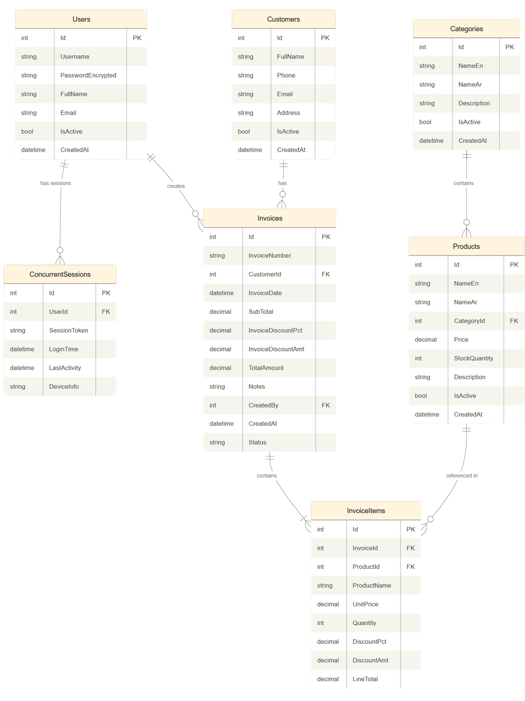
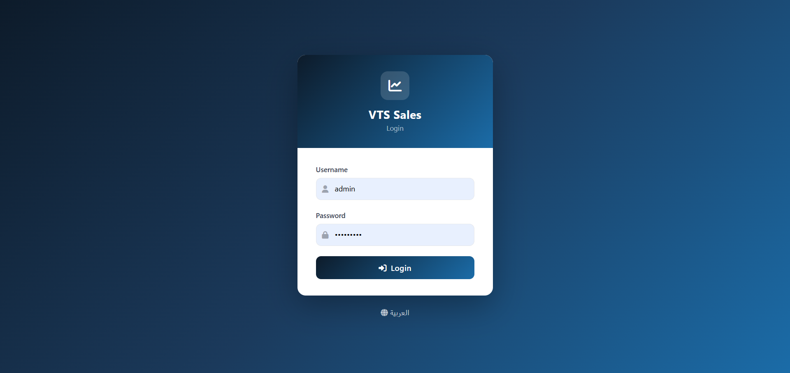
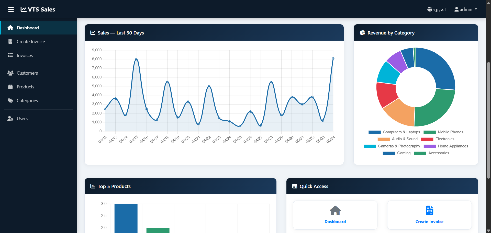
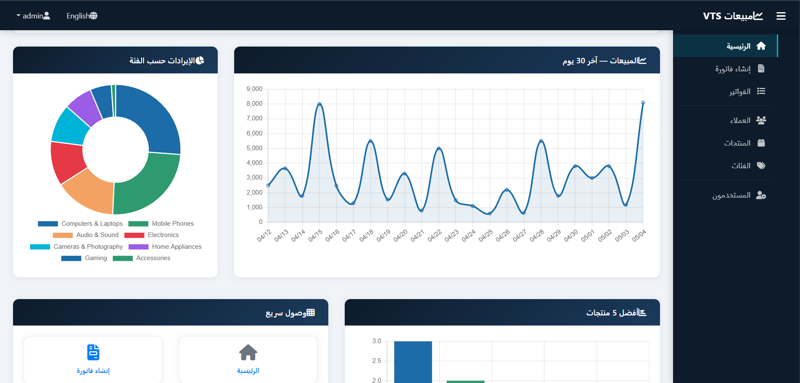
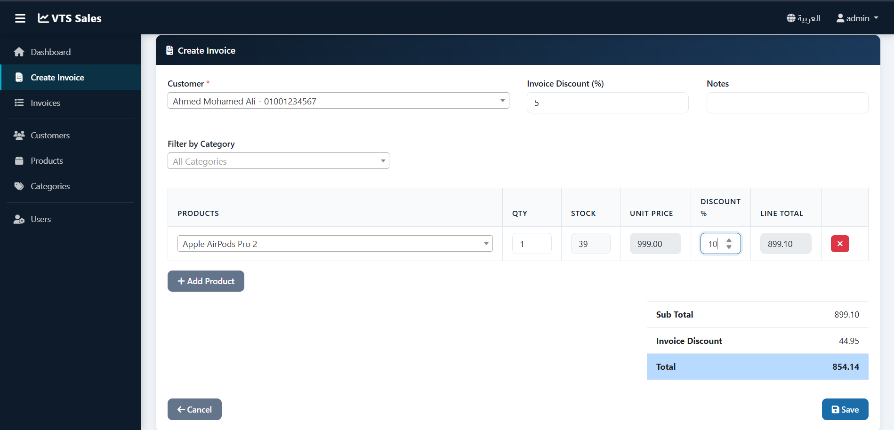
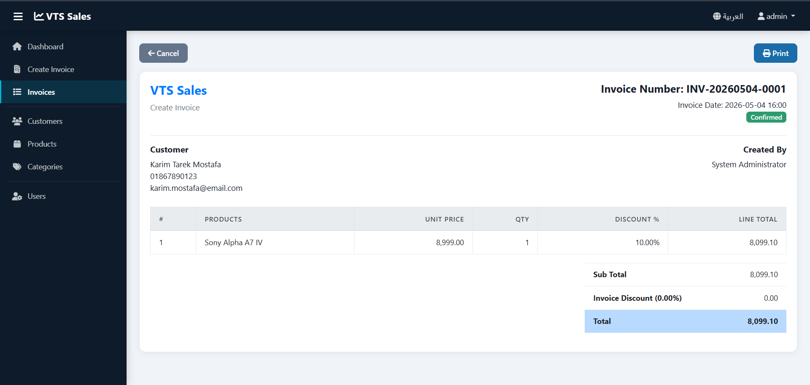
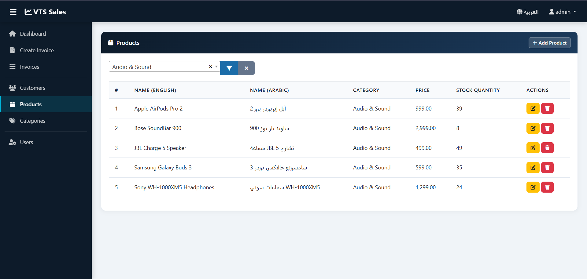
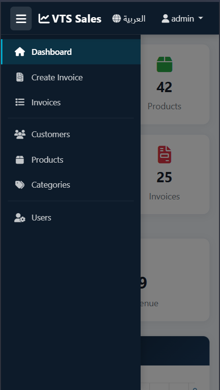
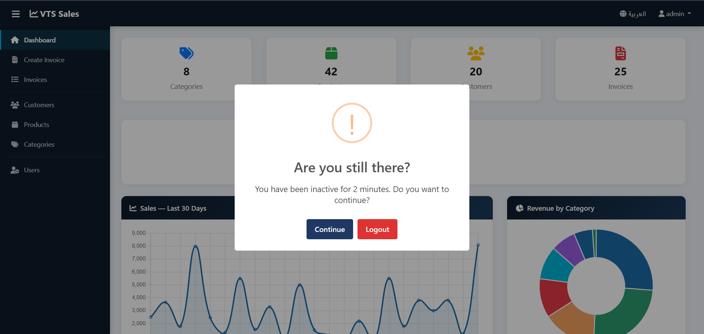

# VTS Sales Web Application

> A full-featured sales management system built with ASP.NET MVC, Entity Framework 6, and SQL Server.

---

## 🔗 Quick Links

| Resource | Link |
|----------|------|
| **Live URL** | http://mahmoudahmed2003-001-site1.ltempurl.com |
| **Default Login** | Username: `admin` / Password: `Admin@123` |
| **GitHub Repo** | *(your GitHub URL here)* |

---

## 📋 Table of Contents

1. [Project Overview](#project-overview)
2. [Technology Stack](#technology-stack)
3. [Features](#features)
4. [Database Schema](#database-schema)
5. [Project Structure](#project-structure)
6. [Security Implementation](#security-implementation)
7. [Internationalization](#internationalization)
8. [UI & Responsiveness](#ui--responsiveness)
9. [Business Logic](#business-logic)
10. [Local Setup](#local-setup)
11. [Deployment](#deployment)
12. [Screenshots](#screenshots)

---

## Project Overview

VTS Sales is a web-based point-of-sale and sales management system designed for retail stores. It supports the full sales cycle from product catalog management through customer management and invoice creation, with multi-language support (Arabic and English) and full mobile responsiveness.

The system was built from scratch as a complete implementation task, completed in 10 days using ASP.NET MVC (.NET Framework 4.8.1) — a technology stack adopted fresh for this project.

---

## Technology Stack

| Layer | Technology |
|-------|-----------|
| Framework | ASP.NET MVC 5 (.NET Framework 4.8.1) |
| Language | C# 7.3+ |
| ORM | Entity Framework 6 (Code First) |
| Database | SQL Server 2019 |
| Frontend | Bootstrap 4.6, HTML5, CSS3 |
| UI Libraries | Select2 4.x (searchable dropdowns), SweetAlert2 (alerts & confirms) |
| Charts | Chart.js 3.9 |
| Auth | FormsAuthentication with custom concurrent-session control |
| Encryption | TripleDES (3DES) — 2-way reversible |
| i18n | .resx Resource Files (en-US + ar-EG) |
| Icons | Font Awesome 6 |
| Hosting | SmarterASP.NET (free tier) |

---

## Features

### Core Requirements
- ✅ **Login** with 3-hour session, auto-redirect if already logged in within session window
- ✅ **Concurrent login prevention** — same account cannot be logged in from two devices simultaneously
- ✅ **Categories CRUD** with cascading delete to products
- ✅ **Products CRUD** with soft delete for products with invoice history
- ✅ **Customers CRUD** with phone uniqueness validation
- ✅ **Sales Invoice** — multi-product, per-line discount, invoice-level discount
- ✅ **Idle timeout** — 2-minute inactivity warning via SweetAlert2 dialog
- ✅ **2-way password encryption** using TripleDES
- ✅ **Client-side + server-side validation** on all forms
- ✅ **Responsive mobile layout** with different icon order on mobile vs desktop
- ✅ **Arabic + English** language support with RTL layout for Arabic
- ✅ **Code First** database using Entity Framework migrations

### Enhancements
- ✅ **Stock management** — stock deducted on invoice save, validation prevents overselling
- ✅ **User management** — create/edit users, reset own password, activate/deactivate
- ✅ **Dashboard charts** — sales over 30 days (line), top 5 products (bar), revenue by category (doughnut)
- ✅ **Pagination** on all list pages (Categories: 10/page, Products/Customers: 15/page, Invoices: 20/page)
- ✅ **Invoice search & filter** — by date range, customer, and status
- ✅ **Collapsible sidebar navigation** — collapses to icon-only, mobile overlay, state persisted in localStorage, RTL-aware
- ✅ **UI refresh** — modern color palette, gradient card headers, polished login page

---

## Database Schema

The database consists of 7 tables managed via Entity Framework Code First migrations.

### Tables

#### Users
Stores login accounts. Passwords are stored as TripleDES-encrypted strings, never plaintext.
```
Id | Username | PasswordEncrypted | FullName | Email | IsActive | CreatedAt
```

#### ConcurrentSessions
Tracks active login tokens to enforce single-device login. A row is inserted on login and deleted on logout or session expiry.
```
Id | UserId (FK→Users) | SessionToken | LoginTime | LastActivity | DeviceInfo
```

#### Categories
Product groupings with bilingual names. Deleting a category cascades to delete all its products (if no invoice history exists).
```
Id | NameEn | NameAr | Description | IsActive | CreatedAt
```

#### Products
Items for sale. Linked to a Category. Uses soft delete (IsActive=false) if the product appears in any invoice, to preserve invoice history.
```
Id | NameEn | NameAr | CategoryId (FK→Categories) | Price | StockQuantity | Description | IsActive | CreatedAt
```

#### Customers
Buyer profiles. Phone number is unique. Soft-deleted if they have invoices.
```
Id | FullName | Phone | Email | Address | IsActive | CreatedAt
```

#### Invoices
Sales invoice header. InvoiceNumber is auto-generated as `INV-YYYYMMDD-####`. Status can be Draft, Confirmed, or Cancelled. Invoices are never hard-deleted.
```
Id | InvoiceNumber | CustomerId (FK→Customers) | InvoiceDate | SubTotal | InvoiceDiscountPct | InvoiceDiscountAmt | TotalAmount | Notes | CreatedBy (FK→Users) | CreatedAt | Status
```

#### InvoiceItems
Line items within an invoice. ProductName and UnitPrice are **snapshotted** at time of sale so invoice history is preserved even if the product price changes later.
```
Id | InvoiceId (FK→Invoices, CASCADE) | ProductId (FK→Products, NO CASCADE) | ProductName | UnitPrice | Quantity | DiscountPct | DiscountAmt | LineTotal
```

### Key Relationships
- `Categories → Products`: **CASCADE DELETE** — deleting a category deletes all its products
- `Invoices → InvoiceItems`: **CASCADE DELETE** — deleting an invoice deletes its line items
- `Products → InvoiceItems`: **NO CASCADE** — product history preserved in invoices
- `Customers → Invoices`: **NO CASCADE** — customer history preserved

---

## Project Structure

```
WebApplication2/
├── Controllers/
│   ├── AuthController.cs          Login, logout, keep-alive, language switch
│   ├── HomeController.cs          Dashboard + chart data AJAX endpoints
│   ├── CategoriesController.cs    CRUD + cascade check
│   ├── ProductsController.cs      CRUD + soft delete + stock
│   ├── CustomersController.cs     CRUD + phone uniqueness + search AJAX
│   ├── InvoicesController.cs      Create, list, details, cancel + filter
│   └── UsersController.cs         Create, edit, reset password, toggle active
│
├── Models/
│   ├── Entities/                  EF entity classes (7 tables)
│   ├── ViewModels/                DTOs for views
│   └── Data/
│       └── AppDbContext.cs        DbContext with relationship config
│
├── Helpers/
│   ├── EncryptionHelper.cs        3DES encrypt/decrypt
│   ├── LanguageHelper.cs          Get/set language cookie, apply culture
│   └── InvoiceNumberHelper.cs     Auto-generate INV-YYYYMMDD-#### 
│
├── Filters/
│   └── CustomAuthorizeAttribute.cs  Session token validation on every request
│
├── Resources/
│   ├── Labels.resx                English strings
│   └── Labels.ar.resx             Arabic strings
│
├── Views/
│   ├── Auth/Login.cshtml
│   ├── Home/Index.cshtml          Dashboard with charts + icon grid
│   ├── Categories/                Index, Create, Edit
│   ├── Products/                  Index, Create, Edit
│   ├── Customers/                 Index, Create, Edit
│   ├── Invoices/                  Index (with filter), Create, Details
│   ├── Users/                     Index, Create, Edit, ResetPassword
│   └── Shared/
│       ├── _Layout.cshtml         Master layout: sidebar, navbar, idle timer
│       └── _Pagination.cshtml     Shared pagination partial
│
├── Migrations/                    EF Code First migration files
├── Web.config                     Connection string, Forms auth config
└── Web.Release.config             Production connection string transform
```

---

## Security Implementation

### Password Encryption
All passwords are encrypted using TripleDES (3DES) before storage. The encryption key is stored in `Web.config` under `<appSettings>`. The `EncryptionHelper` class provides `Encrypt(string)` and `Decrypt(string)` methods.

This is 2-way (reversible) encryption as specified in the requirements. The encrypted value stored in the database is a Base64 string.

### Session Management
- FormsAuthentication with a 3-hour sliding expiration
- A custom `FormsAuthenticationTicket` stores a GUID session token in the `UserData` field
- On every request, `CustomAuthorizeAttribute` decrypts the ticket, extracts the token, and verifies it exists in the `ConcurrentSessions` table
- If the token is missing or expired: cookie cleared, session row deleted, redirect to login

### Concurrent Login Prevention
When a user logs in, the system checks `ConcurrentSessions` for an existing row with the same `UserId`. If found, login is rejected with an "already logged in from another device" message. The session row is deleted on logout, browser close (via idle cleanup), or session expiry.

Expired sessions (older than 3 hours) are automatically cleaned up on every login attempt.

### Anti-CSRF
All POST forms include `@Html.AntiForgeryToken()` and all POST actions are decorated with `[ValidateAntiForgeryToken]`.

---

## Internationalization

The app supports Arabic (ar-EG) and English (en-US) using .NET Resource Files.

- `Resources/Labels.resx` — English (default, generates `Labels` class)
- `Resources/Labels.ar.resx` — Arabic (no code generation; auto-selected when culture is ar-EG)

The user's language preference is stored in a 1-year cookie named `lang`. On every request, `Application_BeginRequest` in `Global.asax` reads the cookie and sets `Thread.CurrentThread.CurrentCulture` and `CurrentUICulture`.

RTL layout for Arabic is implemented via CSS variables and direction overrides in the `_Layout.cshtml` `<style>` block, applied when `dir="rtl"` is set on the `<html>` tag.

---

## UI & Responsiveness

### Sidebar Navigation
The sidebar is fixed to the left (right in Arabic RTL mode) and contains all navigation links. It:
- Collapses to icon-only mode on desktop (toggle button in navbar)
- Appears as a full-width overlay on mobile, hidden by default
- Remembers collapsed/expanded state in `localStorage`
- Highlights the active page link with a teal left-border accent

### Home Page Icon Order
The Quick Access icon grid uses Bootstrap's `order-*` and `order-md-*` classes to display icons in a different order on mobile vs desktop:

| Icon | Desktop | Mobile |
|------|---------|--------|
| Dashboard | 1st | 5th |
| Create Invoice | 2nd | 1st |
| Invoices | 3rd | 2nd |
| Customers | 4th | 3rd |
| Products | 5th | 4th |
| Categories | 6th | 6th |

### Idle Timeout
A JavaScript timer resets on every `mousemove`, `keydown`, `click`, and `scroll` event. After 2 minutes of inactivity a SweetAlert2 dialog appears with "Continue" and "Logout" buttons. If the user clicks Continue, an AJAX POST to `/Auth/KeepAlive` updates the `LastActivity` timestamp in `ConcurrentSessions`. If they click Logout, they are redirected to `/Auth/Logout`. If they ignore the dialog, it stays open indefinitely (no auto-logout per business requirement).

---

## Business Logic

### Invoice Calculation
```
LineTotal = (UnitPrice × Quantity) - (UnitPrice × Quantity × LineDiscountPct / 100)
SubTotal  = Σ LineTotals
InvoiceDiscountAmt = SubTotal × InvoiceDiscountPct / 100
TotalAmount = SubTotal - InvoiceDiscountAmt
```

All calculations happen both client-side (live JS preview) and server-side (authoritative save).

### Price Snapshot
When an invoice is saved, `ProductName` and `UnitPrice` are copied from the Product record into `InvoiceItems`. This means if a product's price changes later, all historical invoices retain the price at time of sale.

### Stock Management
When an invoice is saved (status = Confirmed):
1. Server validates each line: `Quantity > 0` and `Quantity <= Product.StockQuantity`
2. If any line fails: invoice is rejected with an error message
3. If all lines pass: stock is deducted inside the same database transaction

### Soft Delete Rules
| Entity | Condition | Action |
|--------|-----------|--------|
| Category | Has active products | Block delete, show error |
| Category | No active products | Hard delete (cascades to products) |
| Product | Has invoice history | Soft delete (IsActive=false) |
| Product | No invoice history | Hard delete |
| Customer | Has invoices | Soft delete |
| Customer | No invoices | Hard delete |
| User | Is last active user | Block deactivation |
| User | Deactivates self | Soft delete + auto logout |

---

## Local Setup

### Prerequisites
- Visual Studio 2022 Community
- SQL Server 2022 Developer Edition (or LocalDB)
- SQL Server Management Studio (SSMS)

### Steps

1. **Clone the repository**
   ```
   git clone https://github.com/YOURUSERNAME/VTSSales.git
   ```

2. **Open the solution**
   Open `WebApplication2.sln` in Visual Studio 2022

3. **Update the connection string**
   In `Web.config`, update `DefaultConnection`:
   ```xml
   <add name="DefaultConnection"
        connectionString="Data Source=(localdb)\MSSQLLocalDB;Initial Catalog=VTSSalesDB;Integrated Security=True;MultipleActiveResultSets=True"
        providerName="System.Data.SqlClient" />
   ```

4. **Run migrations**
   In Package Manager Console:
   ```
   Update-Database
   ```
   This creates the database and seeds the admin user.

5. **Run the project**
   Press `F5`. The browser opens at the login page.

6. **Login**
   - Username: `admin`
   - Password: `Admin@123`

---

## Deployment

The app is hosted on **SmarterASP.NET** (free tier, supports .NET Framework 4.8.1).

**Production database:** `sql6030.site4now.net` (SQL Server 2019)

To update production after making changes:
1. Change build config to **Release** in Visual Studio
2. Build → Build Solution
3. Open FileZilla, connect to `win6215.site4now.net` with FTP credentials
4. Upload contents of `obj/Release/Package/PackageTmp/` to the `site1/` folder on the server
5. If migrations were added: connect to production DB in SSMS and run the migration SQL script

---

## Database ERD



## Screenshots









---

## License

This project was developed and published by Mahmoud Ahmed